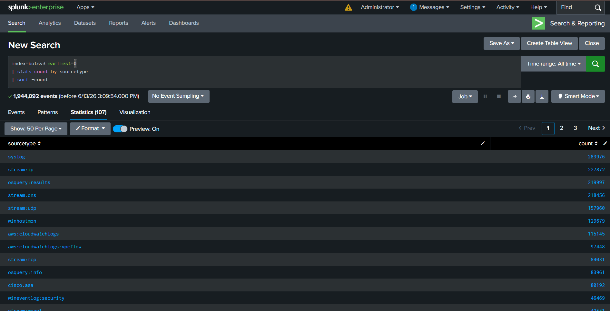
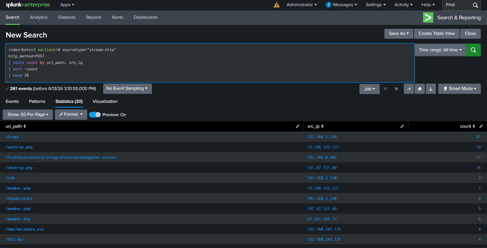
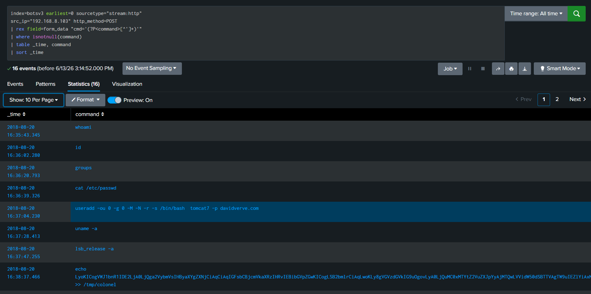
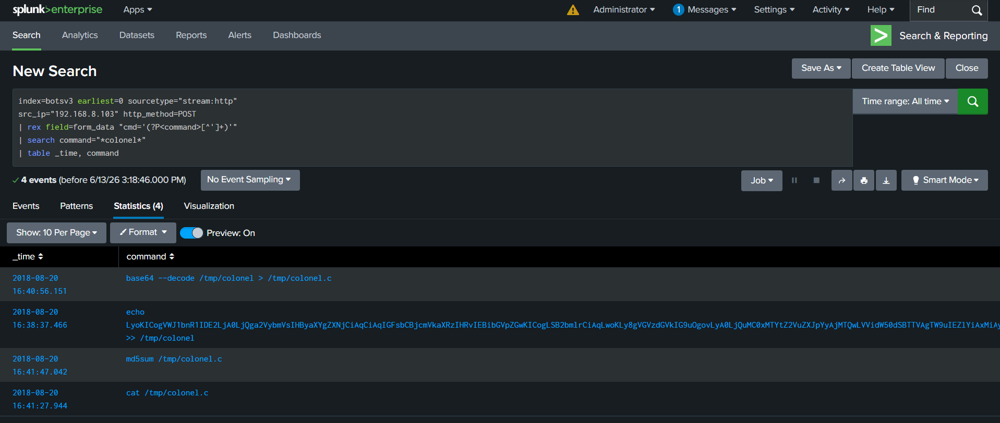
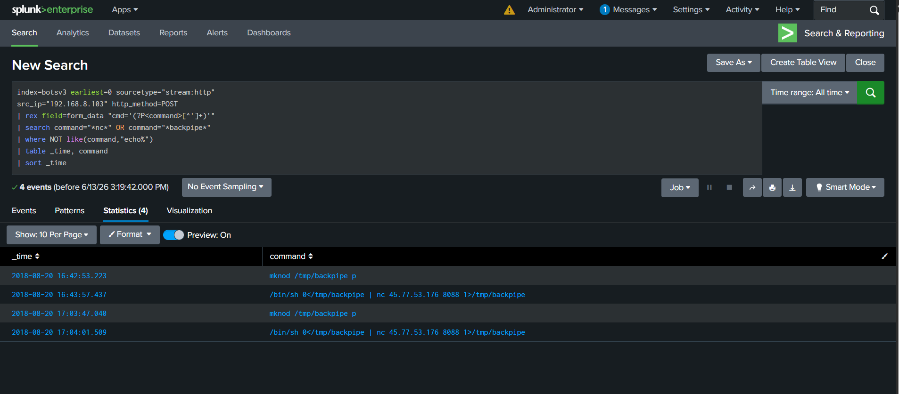
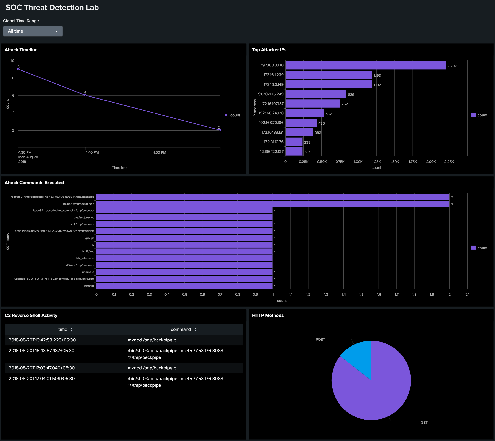

# Cybersecurity Investigation Lab — Threat Hunting with Splunk

> A hands-on SOC analyst project demonstrating real-world threat detection, log analysis, and incident response using Splunk Enterprise and the BOTS v3 dataset.

---

## 📌 Project Overview

This project simulates a real security operations center (SOC) investigation. I acted as a Tier 1 SOC analyst, analyzing enterprise attack logs to detect, investigate, and document a complete cyber attack chain.

### The Scenario

A fictional company called Frothly Inc. experienced a security breach. Using Splunk, I analyzed their network and system logs to uncover how the attacker gained access, what they did, and how they maintained persistence.

### Attack Type Discovered

**Apache Struts2 Remote Code Execution (CVE-2018-11776)** — the same vulnerability exploited in the Equifax data breach.

---

## 🛠️ Tools & Environment

| Tool | Purpose |
|------|---------|
| Splunk Enterprise | SIEM platform for log analysis |
| BOTS v3 Dataset | Realistic enterprise attack data |
| SPL | Splunk's search language for queries |
| MITRE ATT&CK | Framework for mapping attacker techniques |

---

## 📊 Investigation Steps

### 1. Initial Log Assessment

First, I explored the dataset to understand what types of logs were available:

```spl
index=botsv3 earliest=0 | stats count by sourcetype | sort -count
```

**📸 Screenshot:**



---

### 2. Identifying Suspicious Activity

I looked for unusual POST requests that might indicate an attack:

```spl
index=botsv3 earliest=0 sourcetype="stream:http" http_method=POST
| stats count by uri_path, src_ip
| sort -count
| head 20
```

**Key Discovery:** An IP address (`192.168.8.103`) was repeatedly accessing a suspicious URL (`/frothlyinventory/integration/saveGangster.action`).

**📸 Screenshot:**



---

### 3. Confirming the Attack

I examined the POST data to confirm malicious activity:

```spl
index=botsv3 earliest=0 sourcetype="stream:http" uri_path="/frothlyinventory/integration/saveGangster.action" http_method=POST
| table _time, src_ip, form_data
| sort _time
```

**📸 Screenshot:**


---

### 4. Extracting Attacker Commands

I extracted the hidden commands the attacker executed:

```spl
index=botsv3 earliest=0 sourcetype="stream:http" src_ip="192.168.8.103" http_method=POST
| rex field=form_data "cmd='(?P<command>[^']+)'"
| where isnotnull(command)
| table _time, command
| sort _time
```

**📸 Screenshot:**



---

### 5. Persistence Detection

I found evidence of the attacker creating a backdoor:

```spl
index=botsv3 earliest=0 sourcetype="stream:http" src_ip="192.168.8.103" http_method=POST
| rex field=form_data "cmd='(?P<command>[^']+)'"
| search command="*useradd*"
| table _time, command
```

**📸 Screenshot:**


---

### 6. Privilege Escalation Attempt

The attacker uploaded a kernel exploit called `colonel.c`:

```spl
index=botsv3 earliest=0 sourcetype="stream:http" src_ip="192.168.8.103" http_method=POST
| rex field=form_data "cmd='(?P<command>[^']+)'"
| search command="*colonel*"
| table _time, command
```

**📸 Screenshot:**



---

### 7. Command & Control (C2) Discovery

I detected the attacker establishing a reverse shell to an external server:

```spl
index=botsv3 earliest=0 sourcetype="stream:http" src_ip="192.168.8.103" http_method=POST
| rex field=form_data "cmd='(?P<command>[^']+)'"
| search command="*nc*" OR command="*backpipe*"
| where NOT like(command,"echo%")
| table _time, command
| sort _time
```

**📸 Screenshot:**



---

### 8. SOC Dashboard

I built a real-time SOC dashboard in Splunk with 5 panels:

| Panel | Type | Purpose |
|-------|------|---------|
| Attack Activity Timeline | Line Chart | Visualize attack patterns |
| Top Attackers | Bar Chart | Identify suspicious IPs |
| Command Usage | Bar Chart | See what commands were used |
| C2 Connections | Table | Monitor reverse shell attempts |
| Traffic Distribution | Pie Chart | Analyze HTTP method usage |

**📸 Screenshot:**



---

## 📅 Attack Timeline

| Time | Activity |
|------|----------|
| 15:15 | Automated scanning begins |
| 16:35 | Struts2 RCE exploit execution |
| 16:36 | Reconnaissance (whoami, id) |
| 16:36 | Password file theft (/etc/passwd) |
| 16:37 | Backdoor account creation (tomcat7) |
| 16:38 | Kernel exploit upload (colonel.c) |
| 16:42 | Reverse shell pipe creation |
| 16:43 | C2 connection to 45.77.53.176:8088 |
| 17:04 | Second C2 connection attempt |

---

## 🏛️ MITRE ATT&CK Framework Mapping

| Tactic | Technique | ID |
|--------|-----------|-----|
| Initial Access | Exploit Public-Facing Application | T1190 |
| Execution | Command and Scripting Interpreter | T1059 |
| Discovery | System Information Discovery | T1082 |
| Credential Access | OS Credential Dumping | T1003 |
| Persistence | Create Account | T1136 |
| Privilege Escalation | Exploitation for Privilege Escalation | T1068 |
| Command & Control | Application Layer Protocol | T1071 |

---

## 🔑 Key Findings

| Finding | Detail |
|---------|--------|
| Vulnerability | CVE-2018-11776 (Struts2 RCE) |
| Attacker IP | 192.168.8.103 |
| C2 Server | 45.77.53.176:8088 |
| Backdoor Account | tomcat7 |
| Exploit File | colonel.c |

---

## 🛡️ Recommendations

### Immediate Actions
1. **Block** the C2 server IP address (45.77.53.176) at the firewall
2. **Remove** the backdoor user account (tomcat7)
3. **Patch** the Apache Struts2 vulnerability (CVE-2018-11776)

### Short-Term Actions
4. **Implement** a Web Application Firewall (WAF)
5. **Monitor** all outbound network connections
6. **Enable** comprehensive logging on all critical systems

### Long-Term Actions
7. **Conduct** regular vulnerability assessments
8. **Implement** network segmentation
9. **Provide** security awareness training for employees

---

## 📁 Repository Structure

```
SOC-Splunk-Project/
├── README.md                          ← You are here
├── screenshots/                       ← All investigation screenshots
│   ├── 01_sourcetypes.png
│   ├── 02_suspicious_post_urls.png
│   ├── 03_attacker_confirmed.png
│   ├── 04_attack_commands.png
│   ├── 05_backdoor_account.png
│   ├── 06_kernel_exploit.png
│   ├── 07_c2_reverse_shell.png
│   └── 08_full_dashboard.png
├── detections/                        ← SPL detection rules
│   ├── 01_suspicious_post_urls.spl
│   ├── 02_attacker_confirmed.spl
│   ├── 03_attack_commands.spl
│   ├── 04_c2_reverse_shell.spl
│   └── 05_backdoor_account.spl
└── reports/
    └── Incident_Report_Frothly_APT.md ← Full incident report
```

---

## 👤 About Me

**Kaustubh Rohidas Mahadik**
Aspiring SOC Analyst | Cybersecurity Enthusiast

> *"This project demonstrates real hands-on SOC analyst skills — log analysis, threat hunting, attack investigation, MITRE ATT&CK mapping, dashboard creation, and incident reporting using industry standard tools."*

---

## 📎 References

- [Splunk BOTS v3 Dataset](https://github.com/splunk/botsv3)
- [MITRE ATT&CK Framework](https://attack.mitre.org/)
- [CVE-2018-11776](https://nvd.nist.gov/vuln/detail/CVE-2018-11776)
